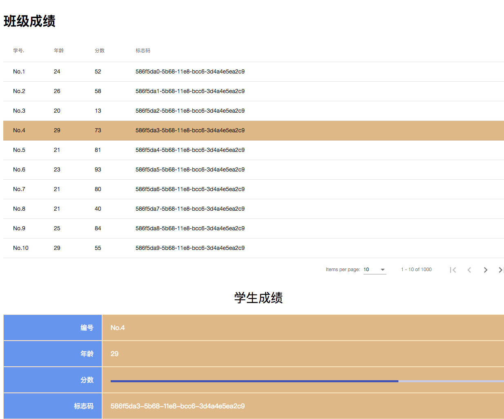
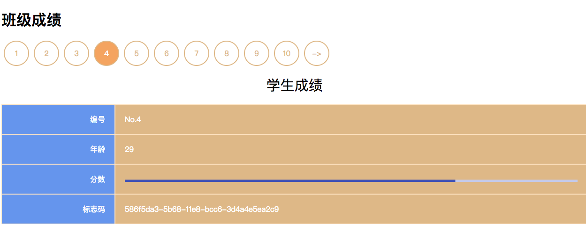

# MatTableDetailToggle

This project was generated with [Angular CLI](https://github.com/angular/angular-cli) version 6.0.1.

### 效果 

 
展开的列表



---
收起的列表




###  1 项目建立步骤
##### 1.1 新建项目
```bash
ng new MatTableDetailToggle --routing --style scss --skip-git --skip-tests --version 1.0.0
```

##### 1.2 安装配置ngrx
```bash
yarn add @ngrx/schematics --dev
yarn add @ngrx/{store,effects,entity,store-devtools}
ng config cli.defaultCollection @ngrx/schematics
ng generate store State --root --module app.module.ts --name
```

##### 1.3 新建@ngrx/entity
```bash
ng g entity boxMaxToggle --name boxMaxToggle -g -f  --path app/reducers/box-max-toogle
```

##### 1.4 新建mongodb
```bash
cd server
mkdir server_db
mongod --dbpath server_db
#  新增数据
node script/mongodb-client-insert.js

```
### 2 运行项目
```bash
cd server
node server.js
```
```bash
# 使用代理
ng serve -o --proxy-config proxy.conf.json
```
